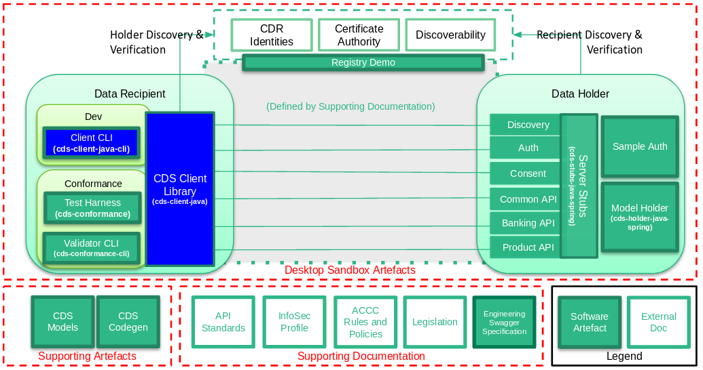

     
Client Artefacts
=====================

Primarily intended for use by :term:`Data Recipient`\'s, the *Client Artefacts* are focused on the accessing and consumption of :term:`CDS` compliant :term:`Data Holder` resources.

The :term:`CDS Engineering` team is actively creating and maintaining two such artefacts notably:

    - :ref:`cds-client-java`: A Command Line interface for Developers to consume target APIs
    - :ref:`cds-client-java-cli`: A reference implementation, written in Java, of the functions available to :term:`Data Recipient`\'s within the :term:`CDR`

.. include:: client-java/quickstart.rst

.. include:: client-java-cli/quickstart.rst
