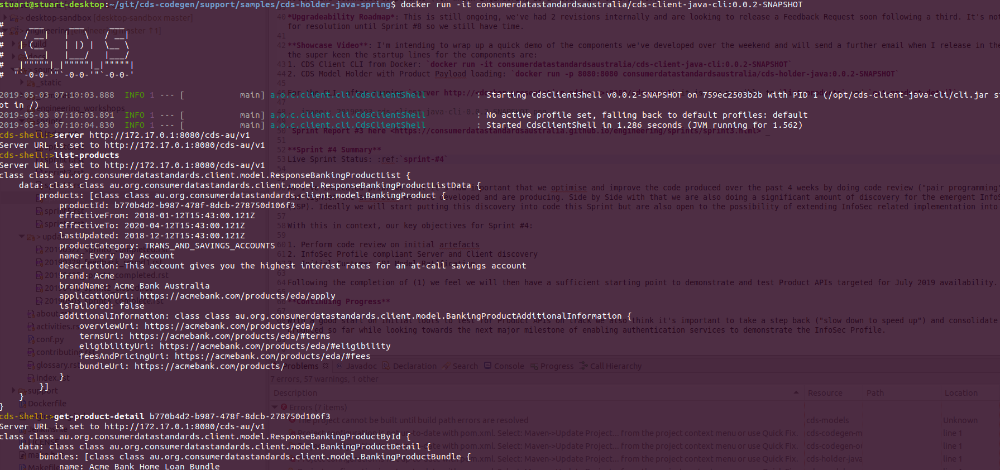

Sprint #3 Complete
================================================

.. post:: May 3, 2019
   :tags: sprint, engineering
   :category: sprint-updates
   :author: csirostu
   :language: en
   :excerpt: 3

It's always great when after effort in many different areas you have something that pays off. Looking back on the past 4-6 weeks and what we've got done we are proud of where we have got so far. It's also a time to take note and improve on what has been developed (more on that later).

This week we made available a number of CDS Codegen generated artefacts:

* Java Client Library available on `Sonatype <https://oss.sonatype.org/#nexus-search;quick~cds-client-java>`__
* Java Client CLI available on `Sonatype  <https://oss.sonatype.org/#nexus-search;quick~cds-client-java-cli>`__ and as a `Docker Container <https://hub.docker.com/u/consumerdatastandardsaustralia>`__

In addition we've developed:

* Java Model Holder available as a `Docker Container <https://hub.docker.com/u/consumerdatastandardsaustralia>`__ and on `GitHub (as source) <https://github.com/ConsumerDataStandardsAustralia/cds-codegen/tree/master/support/samples/cds-holder-java-spring>`_ 
* Server Stubs on `GitHub (as source) <https://github.com/ConsumerDataStandardsAustralia/cds-codegen/tree/master/support/samples/cds-stubs-java-spring>`__ 

Finally we have a very release ("tech preview") of Conformance with:

* Response validation harness for targeting live API Product API endpoints
* File based payload validation which accepts a JSON sample, identifies which target model it is and performs validation on "correctness". 

These are available on `GitHub (as source) <https://github.com/ConsumerDataStandardsAustralia/cds-codegen/tree/cds-artefact-generator/support/samples/cds-conformance>`__

**CDS Codegen**

CDS Codegen is now actively producing the ``cds-client-java`` and ``cds-client-java-cli`` artefacts which is great however we are missing a large portion of documentation and need to do more code review to ensure our code base (which has significantly grown in the past 4 weeks) is as friendly to external parties as possible (thereby encouraging development).

**Conformance Tool**

The Conformance Tool has two modes of operation:

  1. Live targeting of an API, interrogation (listing) of Products and validation of all Product Details to ``cds-models``
  2. File based validation of ``cds-models`` conformance

As mentioned there is an Alpha in source, we'll look to cleanup ease of execution of this in Sprint #4 

**Other Items**

*Engineering Site*: The `Engineering Site <https://consumerdatastandardsaustralia.github.io/engineering/index.html>`__ has been reworked a bit and a blog added. We've also introduced Disqus integration to allow public comment on any of it's content.

*Product API Payload Conformance*: Release as outlined above

*ACCC Registry*: Discussions with the ACCC and their implementation partner have continued with a full day workshop run to align activities as they work through bridging the policy and technical components (for which Engineering is a "coal mine canary" for).

*Upgradeability Roadmap*: This is still ongoing, we've had 2 revisions internally and are looking to release a Feedback Request soon following a third. It's not scheduled for resolution until Sprint #8 so we still have time.

**Showcase Video**: I'm intending to wrap up a quick demo of the components we've developed over the weekend and will send a further email when I release in the meantime for the super keen the startup lines for the holder and CLI are:

  1. CDS Client CLI from Docker: ``docker run -it consumerdatastandardsaustralia/cds-client-java-cli:0.0.2-SNAPSHOT``
  2. CDS Model Holder with Product Payload Loader: ``docker run -p 8080:8080 consumerdatastandardsaustralia/cds-holder-java:0.0.2-SNAPSHOT``

For the CLI, after running ``server http://<docker presentation address>:8080/cds-au/v1`` it is now possible to ``list-products`` and ``get-product-detail``:

`Sprint Report #3 here <https://consumerdatastandardsaustralia.github.io/engineering/sprints/sprint3.html>`_ 

**Sprint #4 Summary**

Live Sprint Status: :ref:`sprint-#4`

As I've indicated prior we feel it's now important that we optimise and improve the code produced over the past 4 weeks by doing code review ("pair programming") to enhance and tighten the artefacts we have developed and are producing. Side by Side with that we are also doing a significant amount of discovery for the emergent InfoSec Profile (ISP). Ideally we will start putting this discovery into code this Sprint but are also open to the possibility of extending InfoSec related implementation into Sprint #5.

With this in context, our key objectives for Sprint #4:

1. Perform code review on initial artefacts
2. InfoSec Profile compliant Server and Client discovery
3. Initial Customer API Model Ratification

Following the completion of (1) we feel we will then have a sufficient starting point to demonstrate and test Product APIs targeted for July 2019 availability.

**Continuing Progress**

With a good start on initial tools to test for Product APIs on track we also think it's important to take a step back ("slow down to speed up") and consolidate what we've produced so far while looking towards the next major milestone of enabling authentication services to demonstrate the InfoSec Profile.

